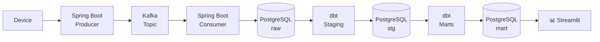

# SpeedTest Recorder

A Playwright-based Speedtest recorder that triggers a speed test from Ookla based on a configured iteration count, records the results, and writes them to a CSV file.
Data is also published to the Kafka service of [`service-metrics-pipeline`](https://github.com/kirkalyn13/service-metrics-pipeline), if enabled.

## Tech Stack

- Java
- Playwright
- Kafka
- Maven

## Features

- Automated Ookla Speedtest execution
- Configurable number of test iterations
- CSV result export
- Results Published to Service Metrics Pipeline
- Screenshot capture per test run
- Captures:
    - ISP
    - IP Address
    - Location
    - Download Speed
    - Upload Speed
    - Idle Latency
    - Download Latency
    - Upload Latency

## Data Pipeline Integration

The application optionally supports sending recorded speed test results to [service-metrics-service](https://github.com/kirkalyn13/service-metrics-service), a standalone Spring Boot microservice that publishes metrics to Kafka and persists them to PostgreSQL.

When enabled, each result is serialized into JSON and sent to the configured pipeline endpoint after the test execution.

## Data Flow



### Features

- Pipeline health check before sending data
- Configurable enable/disable flag
- Sends results as JSON payloads
- Graceful failure handling when the pipeline is unavailable

### Endpoint Used

```text
POST /api/v1/speed-test
```

## Configuration

Create a `config.properties` file under:

```text
src/main/resources/config.properties
```

Example:

```properties
url=https://www.speedtest.net/
pipeline_enabled=true
pipeline_url=http://localhost:8081/api
iterations=10
api_key=your_api_key_here
```

## Running the Application

Install dependencies and run:

```bash
mvn clean package
java -jar target/speedtest-recorder.jar
```

### Arguments

All arguments are optional and will fall back to `config.properties` values if not provided.

| Argument | Description                                                                                   | Example |
|---|-----------------------------------------------------------------------------------------------|---|
| `--url` | Speedtest URL to run against                                                                  | `--url=https://www.speedtest.net/` |
| `--iterations` | Number of test iterations to run                                                              | `--iterations=3` |
| `--pipeline-enabled` | Enable or disable pipeline publishing                                                         | `--pipeline-enabled=true` |
| `--pipeline-url` | Base URL of the pipeline service                                                              | `--pipeline-url=http://localhost:8081/api` |
| `--api-key` | API key for the pipeline service (Highly discouraged, please configure via `config.properties` | `--api-key=your_key_here` |

Example with arguments:

```bash
java -jar target/speedtest-recorder.jar --iterations=3 --pipeline-enabled=true --api-key=secret
```

## Output

The application generates:

- CSV result files

```text
speedtest-results-<timestamp>.csv
```

- Screenshot snapshots

```text
speedtest-<timestamp>.png
```

## Sample CSV Output

```csv
timestamp	isp	ip	location	download_speed_mbps upload_speed_mbps	idle_latency_ms	download_latency_ms	upload_latency_ms
2026-05-25T06:03:44.255704Z	Spectrum	35.144.158.14	Kingsport, TN	1036.72	39.36	27	34	26
```

## Author

- [Engr. Kirk Alyn Santos](https://github.com/kirkalyn13)

## License

MIT